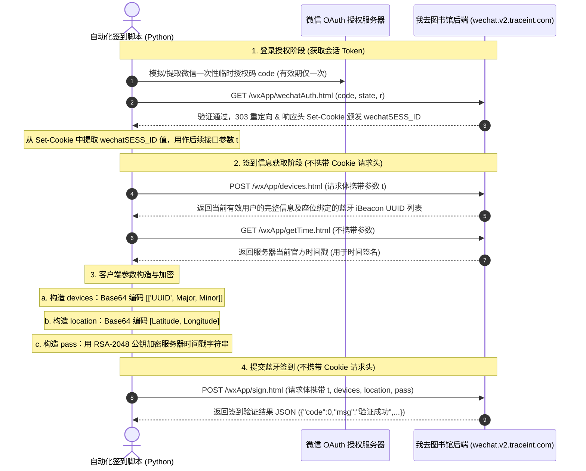

# “我去图书馆”自动蓝牙签到脚本设计规约与接口审计报告

本报告基于原始抓包报文及小程序前端 `/pages/blue/blue.js` 反编译源码进行联合深度审计。

## 核心业务流程图 (Workflow Diagram)

根据抓包时间线的严格还原，整个选座到签到的生命周期流程如下：



---

## 关键接口规约

### 1. 微信授权验证接口 (wechatAuth)

- **作用**：微信端授权成功后，重定向回本系统换取有效 Session 的接口。
- **请求 URL**：`https://wechat.v2.traceint.com/index.php/wxApp/wechatAuth.html`
- **请求方法**：`GET`
- **请求头 (Request Headers)**：
    - `User-Agent`: `Mozilla/5.0 (iPad; CPU OS 27_0 like Mac OS X) AppleWebKit/605.1.15 (KHTML, like Gecko) Mobile/15E148 MicroMessenger/8.0.75(0x18004b21) NetType/WIFI Language/zh_CN miniProgram/wx3b9352e6b254ed2b`
    - `Referer`: `https://open.weixin.qq.com/`
- **请求 Query 参数**：

  | 参数名 | 示例值 | 说明  |
    | --- | --- | --- |
  | `r` | `https://wechat.v2.traceint.com/index.php/wxApp/index.html?n=6a3c74d24ac8a` | 授权验证成功后重定向的目标 H5 页面地址 |
  | `code` | `021jTrFa1uImTE0ZTTFa1Tg41k4jTrFP` | 微信授权服务器返回的临时票据（一次性失效） |
  | `state` | `mockstate123` | CSRF 校验码（由微信授权发起端随机生成） |

- **C# 客户端实现与字段来源解析 (From C# Client Code)**：
  根据对 C# 客户端源码（如 [CodeLinkParser.cs](file:///Users/ryan/DEV/tmp/IGoLibrary/IGoLibrary-Ex/src/IGoLibrary.Ex.Domain/Helpers/CodeLinkParser.cs) 和 [GetCookieServiceImpl.cs](file:///Users/ryan/DEV/tmp/IGoLibrary/IGoLibrary-Winform/Controller/GetCookieServiceImpl.cs)）的审计，本接口的参数在脚本自动化实现时应按如下规则构造：
    1. **`code` (动态正则提取)**：微信 OAuth 流程中由官方生成的 32 位字母数字凭证。C# 客户端并不需要拦截或者计算该值，而是通过检测剪贴板或用户输入的链接，采用正则表达式 `code=([A-Za-z0-9]{32})` 动态匹配出该 32 位 code。
    2. **`r` (硬编码固定)**：重定向的跳转网页地址。因为客户端与签到脚本只关注响应头 `Set-Cookie` 下发的 `wechatSESS_ID`，而不必真的渲染跳转页面，因此 C# 客户端采用**硬编码**方式将 `r` 字段写死为 H5 主页：`https://web.traceint.com/web/index.html` (URL 编码为 `https%3A%2F%2Fweb.traceint.com%2Fweb%2Findex.html`)。
    3. **`state` (硬编码固定)**：安全防 CSRF 跨站参数。对于签到脚本或独立桌面客户端而言，无需防范此类基于浏览器的跨站攻击。因此 C# 客户端采用**硬编码**写死为 `"1"`。
    4. **请求接口的拼接模板**：

    ```text
    https://wechat.v2.traceint.com/index.php/wxApp/wechatAuth.html?r=https%3A%2F%2Fweb.traceint.com%2Fweb%2Findex.html&code={code}&state=1
    ```

- **预期响应**：
    - **HTTP 状态码**：`303 See Other`
    - **响应头 (Response Headers)**：

      ```http
      Location: https://wechat.v2.traceint.com/index.php/wxApp/index.html?n=6a3c74d24ac8a
      Set-Cookie: wechatSESS_ID=c3070dd8e99b7b3d92dbd29fcab3fc0c4be4e6bff205c742; expires=Thu, 25-Jun-2026 01:21:04 GMT; path=/; domain=.traceint.com; httponly
      Set-Cookie: SERVERID=d3936289adfff6c3874a2579058ac651|1782346863|1782346312;Path=/
      ```

    - **脚本处理逻辑**：脚本拦截该响应，并从响应头的 `Set-Cookie` 中提取 `wechatSESS_ID` 的值。此值即为后续所有接口所需的身份验证 Token **`t`**。

---

### 2. 获取目标蓝牙信标列表 (devices)

- **作用**：提供会话 Token，获取当前已占座区域被允许签到的蓝牙 iBeacon 设备 UUID 列表，以及用户详细账号数据。
- **请求 URL**：`https://wechat.v2.traceint.com/index.php/wxApp/devices.html`
- **请求方法**：`POST`
- **请求头 (Request Headers)**：
    - `content-type`: `application/x-www-form-urlencoded`
    - `User-Agent`: `Mozilla/5.0 (iPad; CPU OS 27_0 like Mac OS X) AppleWebKit/605.1.15 (KHTML, like Gecko) Mobile/15E148 MicroMessenger/8.0.75(0x18004b21) NetType/WIFI Language/zh_CN`
    - `Referer`: `https://servicewechat.com/wx3b9352e6b254ed2b/25/page-frame.html`
    - *(注：抓包证实，本请求**不携带**任何 Cookie。身份完全依赖请求体中的 `t` 进行识别)*
- **请求体 (Request Body - UrlEncoded)**：

  ```text
  t=c3070dd8e99b7b3d92dbd29fcab3fc0c4be4e6bff205c742
  ```

- **预期响应 (Success)**：
    - **HTTP 状态码**：`200 OK`
    - **响应体 (JSON)**：

      ```json
      {
        "code": 0,
        "msg": "",
        "data": {
          "user": {
            "user_id": 88888888,
            "user_nick": "Johnny",
            "user_points": 0,
            "user_avg": 0,
            "user_mobile": "13800138000",
            "user_sex": 0,
            "user_passwd": "e10adc3949ba59abbe56e057f20f883e",
            "user_salt": "KsT18274aX9vcd4m",
            "user_sch_top_id": 0,
            "user_sch_id": 99,
            "user_sch": "江南科技大学",
            "user_adate": 1780190383,
            "user_last_login": 1782346313,
            "user_openid": "oORl8t_mocked_openid_88888888",
            "user_id_ali": "",
            "user_uuid": null,
            "user_sch_top": "",
            "user_avatar": "1780190524",
            "user_location": "-",
            "user_frist_device": "weixin",
            "user_from_device": "weixin",
            "user_last_device": "",
            "user_last_login_token": null,
            "user_student_no": "2024090108888",
            "user_student_name": "李华",
            "user_student_department": "",
            "scene_id": "0",
            "user_student_sch": 99,
            "user_setting": null,
            "user_student_exptime": 0,
            "user_card_no": "",
            "area_id": 0,
            "sz_unionid": null,
            "wx_unionid": "orxK96_mocked_unionid_88888888"
          },
          "devices": [
            "e2c56db5-dffb-48d2-b060-d0f5a71096e0"
          ]
        }
      }
      ```


---

### 3. 获取服务器时间接口 (getTime)

- **作用**：获取服务器当前的官方时间戳，用于客户端防重放签名的 RSA 加密。
- **请求 URL**：`https://wechat.v2.traceint.com/index.php/wxApp/getTime.html`
- **请求方法**：`GET`
- **请求头 (Request Headers)**：
    - `User-Agent`: `Mozilla/5.0 (iPad; CPU OS 27_0 like Mac OS X) AppleWebKit/605.1.15 (KHTML, like Gecko) Mobile/15E148 MicroMessenger/8.0.75(0x18004b21) NetType/WIFI Language/zh_CN`
    - `Referer`: `https://servicewechat.com/wx3b9352e6b254ed2b/25/page-frame.html`
    - *(注：本请求同样**不携带**任何 Cookie。返回的 Set-Cookie 会话 ID 是新生成的，无需保存)*
- **预期响应 (Success)**：
    - **HTTP 状态码**：`200 OK`
    - **响应体（纯文本）**：一个时间戳字符串，例如：`1782346868`。

---

### 4. 提交蓝牙签到 (sign)

- **作用**：提交探测到的蓝牙设备、Base64 地理坐标以及用 RSA 加密的时间签名以完成签到。

- **请求 URL**：`https://wechat.v2.traceint.com/index.php/wxApp/sign.html`

- **请求方法**：`POST`

- **请求头 (Request Headers)**：

    - `content-type`: `application/x-www-form-urlencoded`
    - `User-Agent`: `Mozilla/5.0 (iPad; CPU OS 27_0 like Mac OS X) AppleWebKit/605.1.15 (KHTML, like Gecko) Mobile/15E148 MicroMessenger/8.0.75(0x18004b21) NetType/WIFI Language/zh_CN`
    - `Referer`: `https://servicewechat.com/wx3b9352e6b254ed2b/25/page-frame.html`
    - *(注：本请求同样**不携带**任何 Cookie)*
- **请求体 (Request Body - UrlEncoded)**：

  | 参数名 | 类型  | 说明  |
    | --- | --- | --- |
  | `t` | String | 必填。从 `wechatAuth.html` 响应的 Cookie 中提取的 `wechatSESS_ID` 值 |
  | `devices` | String | 必填。经 Base64 编码的蓝牙信标信息数组：`Base64( JSON.stringify( [[UUID, Major, Minor]] ) )`。注意 UUID 必须为大写。 |
  | `location` | String | 必填。经 Base64 编码的 GCJ-02 坐标数组：`Base64( JSON.stringify( [Latitude, Longitude] ) )` |
  | `pass` | String | 必填。用内置 RSA-2048 公钥加密 `getTime.html` 获取到的服务器时间戳字符串，再转换为 Base64。使用 PKCS#1 v1.5 填充。 |

- **预期响应 (Success)**：

    - **HTTP 状态码**：`200 OK`
    - **响应体 (JSON)**：

      ```json
      {
        "code": 0,
        "msg": "验证成功",
        "data": {
          "token": "88888888-c3070dd8e99b7b3d92dbd29fcab3fc0c",
          "status": 2,
          "user_id": 88888888,
          "user_mobile": "13800138000",
          "user_from_device": "weixin",
          "user_nick": "Johnny",
          "sch_id": 99,
          "sch_name": "江南科技大学",
          "lib_id": 101,
          "lib_name": "第三电子阅览室",
          "lib_floor": "3楼",
          "lib_open_time": 1782342000,
          "lib_close_time": 1782396000,
          "seat_key": "12,34",
          "seat_name": "042",
          "date": 1782346716,
          "exp_date": 1782348516,
          "validate_date": 0,
          "hold_num_1": 0,
          "hold_last_time": 1782316800,
          "token1": "88888888-e10adc3949ba59abbe56e057f20f883e,1782346735",
          "rtime": 1782346868
        }
      }
      ```


---

## 客户端参数生成算法

### 1. `devices` 参数

- **算法**：`Base64( JSON.stringify( [[UUID, Major, Minor]] ) )`
- **细节**：
    - UUID 必须是大写，且必须是 `devices.html` 返回的允许列表中的值。
    - Major、Minor 分别为蓝牙 Beacon 广播出的主次 ID（在实际抓包中分别对应 `10001` 和 `20002`）。
    - **示例明文**：`[["E2C56DB5-DFFB-48D2-B060-D0F5A71096E0", 10001, 20002]]`
    - **编码密文**：`W1siRTJDNTZEQjUtREZGQi00OEQyLUIwNjAtRDBGNUE3MTA5NkUwIiwxMDAwMSwyMDAwMl1d`

### 2. `location` 参数

- **算法**：`Base64( JSON.stringify( [Latitude, Longitude] ) )`
- **细节**：
    - 使用高精度 GCJ-02 国测局坐标系下的经纬度。
    - **示例明文**：`[39.908722, 116.397499]`
    - **编码密文**：`WzM5LjkwODcyMiwxMTYuMzk3NDk5XQ==`

### 3. `pass` 参数

- **算法**：`RSA-2048-PKCS1_v1.5( Server_Timestamp_String ) -> Base64`
- **内置 RSA 公钥 (PEM 格式)**：

  ```text
  -----BEGIN PUBLIC KEY-----
  MIIBIjANBgkqhkiG9w0BAQEFAAOCAQ8AMIIBCgKCAQEA0dmmkW4xPa+HhBTyaa0d
  gAb0fVZRS67jK4y15BQthjJ/ZuUZQmrbGqhG7rwnxfm7g+nFH9zEyRU5KLX3ty9j
  pNrPjyg7FBF9OvBDYHEt83b77W3mfBjpmoTJOt27E7RZ4InHqJQjqSEo4bw1PDz2
  OBmtlNIlXMu0VA8I0Bh39hBBnm0oouRV7FdqEzAp8nsF7a3VuBYpx9xek+cRVip0
  pMXI1AXM6bmyWWNzV0oikQW4ZIbutgDziTMeW28zl/hRbW9Ht34w0sWYyxumuLr1
  qweW3qnxycn3zn47weFYe6nJp71z+lgVtNTGtowNPPqBLXqusvwf+uNhSy1wKQFp
  UwIDAQAB
  -----END PUBLIC KEY-----
  ```


---

## 签到脚本的 Python 原型实现

以下是直接使用 Python 实现的蓝牙签到核心逻辑代码。脚本中未包含任何真实敏感隐私数据，均使用测试专用的假数据填充，方便直接参考和修改。

```python
import base64
import json
import urllib.request
import urllib.parse
from Crypto.PublicKey import RSA
from Crypto.Cipher import PKCS1_v1_5

# ----------------- 1. 配置参数 (请填入您自己的真实信息) -----------------
# 抓包获取的有效 Session Token (即 wechatSESS_ID 值)
SESSION_TOKEN = "c3070dd8e99b7b3d92dbd29fcab3fc0c4be4e6bff205c742"

# 你的座位绑定的蓝牙 iBeacon 配置 (从 devices.html 接口获取 UUID)
BEACON_UUID = "E2C56DB5-DFFB-48D2-B060-D0F5A71096E0"  # 必须大写
BEACON_MAJOR = 10001
BEACON_MINOR = 20002

# 你的 GCJ-02 定位经纬度 (北京天安门广场示例)
LATITUDE = 39.908722
LONGITUDE = 116.397499

# 内置的 RSA-2048 公钥
PUBLIC_KEY_PEM = """-----BEGIN PUBLIC KEY-----
MIIBIjANBgkqhkiG9w0BAQEFAAOCAQ8AMIIBCgKCAQEA0dmmkW4xPa+HhBTyaa0d
gAb0fVZRS67jK4y15BQthjJ/ZuUZQmrbGqhG7rwnxfm7g+nFH9zEyRU5KLX3ty9j
pNrPjyg7FBF9OvBDYHEt83b77W3mfBjpmoTJOt27E7RZ4InHqJQjqSEo4bw1PDz2
OBmtlNIlXMu0VA8I0Bh39hBBnm0oouRV7FdqEzAp8nsF7a3VuBYpx9xek+cRVip0
pMXI1AXM6bmyWWNzV0oikQW4ZIbutgDziTMeW28zl/hRbW9Ht34w0sWYyxumuLr1
qweW3qnxycn3zn47weFYe6nJp71z+lgVtNTGtowNPPqBLXqusvwf+uNhSy1wKQFp
UwIDAQAB
-----END PUBLIC KEY-----"""

# ----------------- 2. 工具加密函数 -----------------
def rsa_encrypt(text, pub_key_pem):
    """使用 PKCS#1 v1.5 进行 RSA-2048 加密并输出 Base64 字符串"""
    key = RSA.importKey(pub_key_pem)
    cipher = PKCS1_v1_5.new(key)
    ciphertext = cipher.encrypt(text.encode("utf-8"))
    return base64.b64encode(ciphertext).decode("utf-8")

def base64_json_encode(obj):
    """将对象序列化为无空格的 JSON 并进行 Base64 编码"""
    json_str = json.dumps(obj, separators=(',', ':'))
    return base64.b64encode(json_str.encode("utf-8")).decode("utf-8")

# ----------------- 3. 主签到请求流程 -----------------
def do_sign():
    headers = {
        "User-Agent": "Mozilla/5.0 (iPad; CPU OS 27_0 like Mac OS X) AppleWebKit/605.1.15 (KHTML, like Gecko) Mobile/15E148 MicroMessenger/8.0.75(0x18004b21) NetType/WIFI Language/zh_CN",
        "Referer": "https://servicewechat.com/wx3b9352e6b254ed2b/25/page-frame.html"
    }

    # Step 1: 获取服务器当前时间戳
    print("[*] 正在从 getTime.html 获取服务器时间...")
    time_req = urllib.request.Request("https://wechat.v2.traceint.com/index.php/wxApp/getTime.html", headers=headers)
    with urllib.request.urlopen(time_req) as response:
        server_time = response.read().decode("utf-8").strip()
    print(f"[+] 成功获取服务器时间戳: {server_time}")

    # Step 2: 加密与编码参数
    # 加密 pass
    print("[*] 正在使用 RSA-2048 对时间戳进行加密签名...")
    encrypted_pass = rsa_encrypt(server_time, PUBLIC_KEY_PEM)

    # 编码 devices
    devices_data = [[BEACON_UUID, BEACON_MAJOR, BEACON_MINOR]]
    encoded_devices = base64_json_encode(devices_data)

    # 编码 location
    location_data = [LATITUDE, LONGITUDE]
    encoded_location = base64_json_encode(location_data)

    # Step 3: 发起 sign.html POST 请求完成签到
    print("[*] 正在提交 sign.html 提交蓝牙签到...")
    post_fields = {
        "t": SESSION_TOKEN,
        "devices": encoded_devices,
        "location": encoded_location,
        "pass": encrypted_pass
    }
    post_data = urllib.parse.urlencode(post_fields).encode("utf-8")

    headers["content-type"] = "application/x-www-form-urlencoded"
    sign_req = urllib.request.Request("https://wechat.v2.traceint.com/index.php/wxApp/sign.html", data=post_data, headers=headers)

    with urllib.request.urlopen(sign_req) as response:
        result_json = json.loads(response.read().decode("utf-8"))

    print("[+] 签到服务器响应结果：")
    print(json.dumps(result_json, indent=2, ensure_ascii=False))

if __name__ == "__main__":
    # 需要安装依赖: pip install pycryptodome
    do_sign()
```